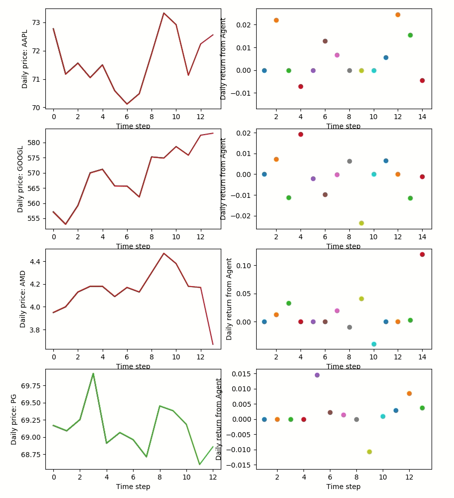
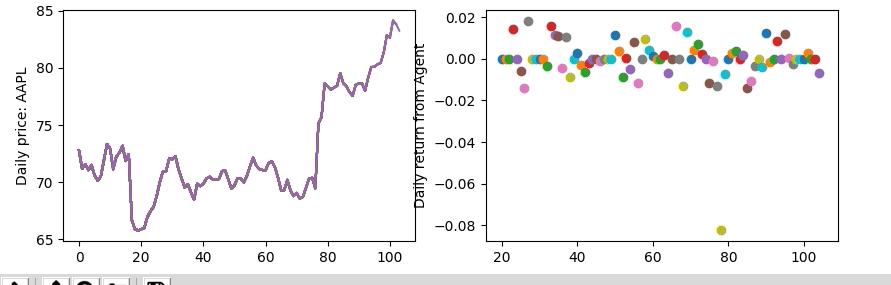

# GYM-STOCK-EXCHANGE

Implementing a `stock-exchange` environment in `OPEN-AI`'s [gym](https://gym.openai.com/) environment.

### Installing
To get started, you’ll need to have `Python 3.5+` installed. 
Simply install `gym` using pip:
```
pip install gym
```

Once `gym` is installed, clone this repository, then run 
```
python3 demo_stock_exchange.py
```

If you want to integrate `reinforcement learning agents`, I recommend using
[baselines](https://github.com/openai/baselines/) or [stable baselines](https://github.com/hill-a/stable-baselines), described below.

### Examples of Reinforcement Learnings
This environment was created for the purpose of integrating with other 
`reinforcement learning` 
libraries. Namely, [baselines](https://github.com/openai/baselines/) 
and [stable baselines](https://github.com/hill-a/stable-baselines) 
are great possibilities.
`demo_exchange.py` has an example of how easy it is to integrate this `env` with 
`stable baselines`. 

With a `random agent`, an output of `demo_stock_exchange.py` is like so:



With `stable-baselines`, `Advantage Actor Critic (A2C)` is used in the `demo_exchange.py` to train the model. An output of such is like so:


### gym_exchange vs gym_stock_exchange
The two are seperated for the time being. With `gym_exchange`, 
we can integrate it with a large set of other `reinforcement learning` libraries.
`gym_stock_exchange` is to be merged eventually, but `git stashing` for now.

